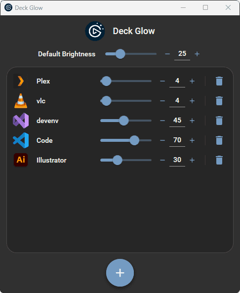

    

<h1 align="center">Deck Glow</h1>

**Deck Glow** is a Windows app that can change your Elgato Stream Deck brightness depending on the currently active application.
It runs in the background in the system tray. Click the tray icon to open the main window, where you can add/remove apps, set the brightness per app, and set the default brightness.

## Download
- [**Latest**](https://github.com/tombayley/DeckGlow/releases/latest)
- [All releases](https://github.com/tombayley/DeckGlow/releases)

If you encounter a popup saying "Windows protected your PC", or similar, click "More Info" in the popup and then click "Run" to continue installing.
Windows displays this security popup because the installer isn't signed. Signing costs hundreds of dollars per year and therefore isn't worth it.

The app is built and released automatically from source using GitHub Actions [here](.github/workflows/main.yml).

## Features
- Set the Stream Deck brightness based on the focused program
- Add a folder to set the brightness of all focused programs in subfolders

## Compatibility
- Should work for all Stream Deck models

## Screenshots

    

